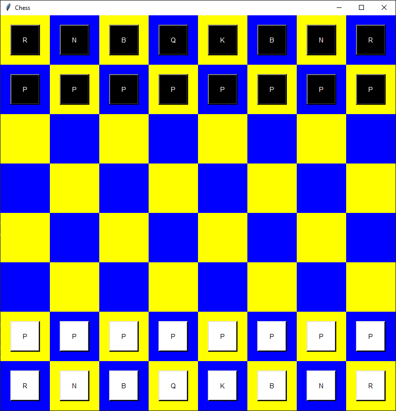
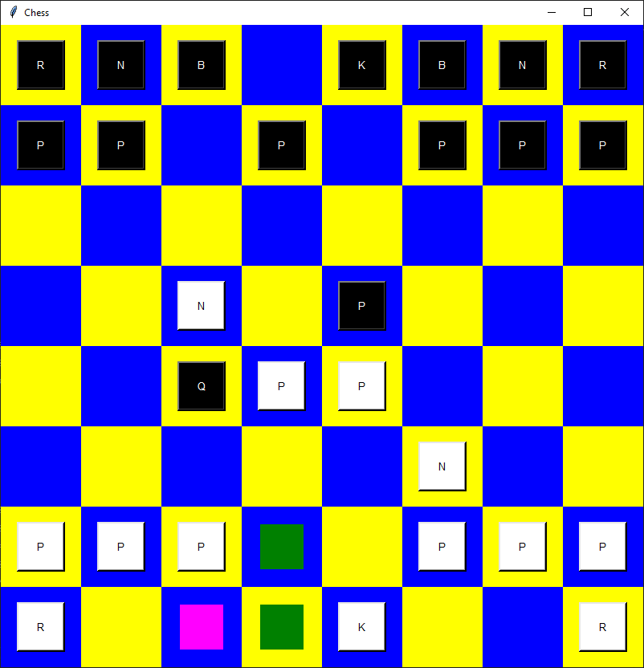
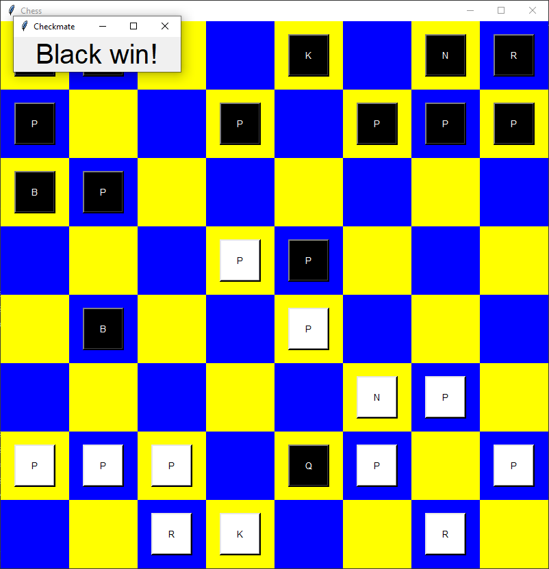

# Chess_Python_Tkinter

# Simple Python Chess

A functional and lightweight chess application built from scratch using **Python** and the **Tkinter** library. This project was developed independently as a final capstone for a programming course, focusing on pure logic and GUI implementation without external game engines.

## 📸 Screenshots

| Start Game | Gameplay | Checkmate |
|:---:|:---:|:---:|
|  |  |  |

*Interface demonstration: From the starting position to the endgame logic.*

## Features
* **Complete Chess Logic:** Full implementation of piece movements and board rules.
* **Pure Python:** Built using the standard library, demonstrating clean code and algorithmic thinking.
* **No AI Assistance:** Every line of code, from the move validation to the coordinate system, was written manually without templates or AI generation.
* **Tkinter GUI:** A clean, responsive interface that works out of the box on most operating systems.

## Tech Stack
* **Language:** Python 3.14.3
* **GUI Framework:** Tkinter (Standard Library)

## Getting Started

### Prerequisites
You only need **Python** installed on your machine. Since Tkinter is included in the Python standard library, no additional `pip install` commands are required.

### Installation & Run
1. Clone the repository:
   git clone https://github.com/Yklymsha-Meredov/Chess_Python_Tkinter.git
   
2. Navigate to the directory:
   cd Chess_Python_Tkinter
   
3. Launch the game:
   python chess_game_yklymsha_meredov.py
